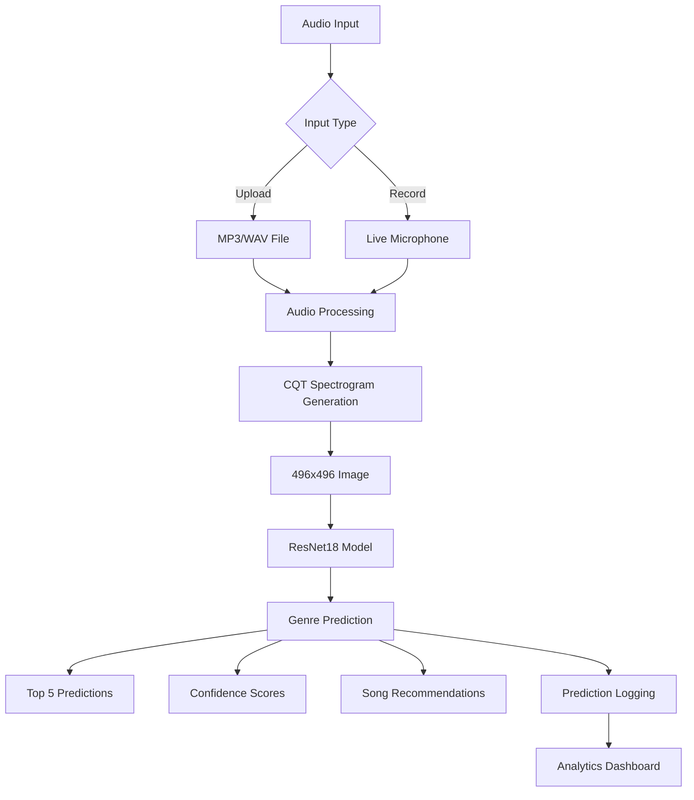
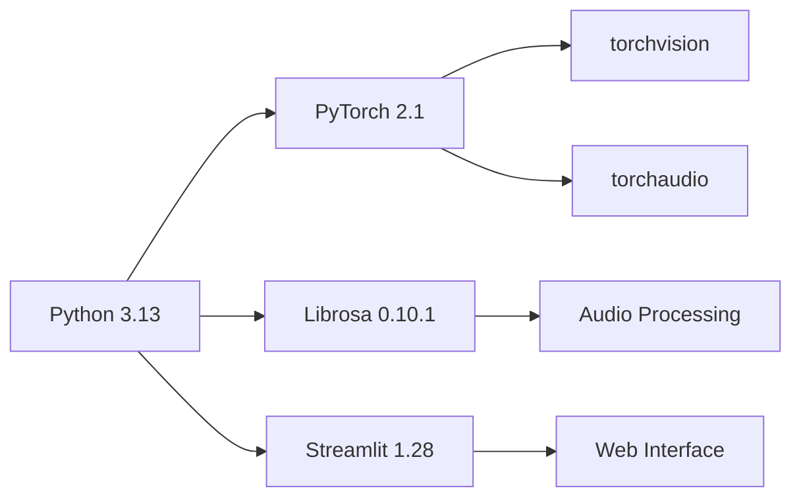
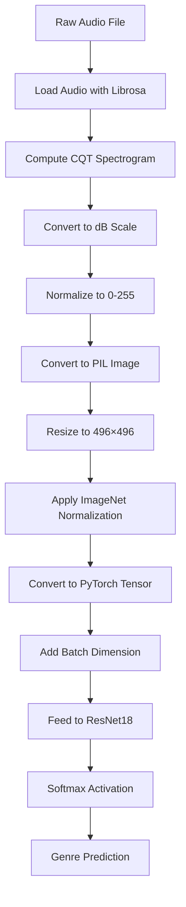

# 🎵 Music Genre Classification System

[](https://www.python.org/)
[](https://pytorch.org/)
[](https://streamlit.io/)
[](LICENSE)

A sophisticated real-time music genre classification system powered by ResNet18 and CQT spectrograms. This application uses deep learning to analyze audio files and classify them into 16 distinct music genres through an intuitive web interface with real-time audio recording capabilities.

---

## 📊 Architecture Overview



---

## 🎯 Key Features

### 🎼 Audio Analysis
- **CQT Spectrogram Generation**: Constant-Q Transform for frequency analysis
- **Real-time Processing**: Converts audio to 496×496 spectrograms
- **Multi-format Support**: Accepts MP3 and WAV files
- **Microphone Recording**: Built-in 10-second audio recording capability

### 🧠 Machine Learning
- **ResNet18 Architecture**: Pre-trained on ImageNet, fine-tuned for music
- **16 Genre Classification**: Comprehensive genre coverage
- **Confidence Scoring**: Probability distributions for predictions
- **Top-5 Predictions**: Shows alternative genre possibilities

### 📱 User Interface
- **Interactive Streamlit App**: Modern, responsive web interface
- **Real-time Visualization**: Live spectrogram display
- **Progress Indicators**: Visual feedback during processing
- **Admin Analytics Dashboard**: Comprehensive prediction statistics

### 📊 Analytics & Logging
- **Prediction Logging**: CSV format with timestamps
- **Usage Statistics**: Track recordings vs uploads
- **Genre Distribution**: Bar charts of prediction frequency
- **Recent Activity**: View last 5 predictions
- **Export Functionality**: Download complete prediction logs

---

## 🎵 Supported Genres

### Classical (4 genres)
- Symphony
- Opera
- Solo
- Chamber

### Pop (4 genres)
- Pop Vocal Ballad
- Adult Contemporary
- Teen Pop
- Acoustic Pop

### Dance (2 genres)
- Contemporary Dance Pop
- Dance Pop

### Indie (2 genres)
- Classic Indie Pop
- Chamber Cabaret and Art Pop

### Soul (1 genre)
- Soul or R&B

### Rock (3 genres)
- Adult Alternative Rock
- Uplifting Anthemic Rock
- Soft Rock

---

## 🛠️ Technology Stack

### Core Technologies


### Deep Learning Stack
- **PyTorch 2.1.0**: Core deep learning framework
- **torchvision 0.16.0**: Pre-trained models and image processing
- **torchaudio 2.1.0**: Audio processing utilities

### Audio Processing
- **Librosa 0.10.1**: Audio analysis and feature extraction
- **soundfile 0.12.1**: Audio file I/O
- **audioread 3.0.1**: Audio decoding

### Web Application
- **Streamlit 1.28.0**: Web interface framework
- **streamlit-mic-recorder 0.0.8**: Audio recording component

### Data Science & Visualization
- **NumPy 1.24.3**: Numerical computing
- **Pandas 2.0.3**: Data manipulation
- **Matplotlib 3.7.3**: Visualization
- **Seaborn 0.12.2**: Statistical visualization
- **scikit-learn 1.3.2**: Machine learning utilities

---

## 📋 Prerequisites

- Python 3.13 or higher
- pip package manager
- Microphone (optional, for recording feature)
- 4GB+ RAM recommended
- Windows/macOS/Linux

---

## 🚀 Installation & Setup

### 1. Clone the Repository
```bash
git clone <your-repository-url>
cd Music_genre_deployement
```

### 2. Create Virtual Environment
```bash
# Windows
python -m venv venv
venv\Scripts\activate

# macOS/Linux
python3 -m venv venv
source venv/bin/activate
```

### 3. Install Dependencies
```bash
pip install -r requirements.txt
```

### 4. Verify Installation
```bash
python -c "import torch; import streamlit; import librosa; print('✅ All packages installed successfully!')"
```

---

## 🎓 Training the Model

### Quick Training (3 epochs, 1000 samples)
```bash
python train.py
```

This will:
- Download the ccmusic-database/music_genre dataset
- Train ResNet18 for 3 epochs
- Save model checkpoints:
  - `genre_model.pth` (final model)
  - `genre_model_best.pth` (best validation accuracy)
  - `training_history.pth` (training metrics)

### Training Configuration
```python
BATCH_SIZE = 16
NUM_EPOCHS = 3
LEARNING_RATE = 0.001
MAX_TRAIN_SAMPLES = 1000
MAX_VAL_SAMPLES = 200
```

### Expected Training Time
- **CPU**: ~30 minutes
- **GPU**: ~10 minutes

### Training Output
```
============================================================
Training Complete!
============================================================
Total training time: 1777.14 seconds (29.62 minutes)

Final Results:
  Train Accuracy: 48.10%
  Val Accuracy:   38.50%

Best Validation Accuracy: 38.50%

Saved files:
  - genre_model.pth (final model)
  - genre_model_best.pth (best model)
  - training_history.pth (training history)
============================================================
```

---

## 🌐 Running the Application

### Start the Streamlit App
```bash
streamlit run app.py
# or
python -m streamlit run app.py
```

### Access the Application
- **Local URL**: http://localhost:8501
- **Network URL**: http://<your-ip>:8501

### Using the Application

#### Option 1: Upload Audio File
1. Select "📁 Upload Audio File"
2. Click "Choose a WAV or MP3 file"
3. Upload your music file
4. View spectrogram and predictions

#### Option 2: Record Audio
1. Select "🎤 Record Audio"
2. Click "🎤 Start Recording"
3. Record up to 10 seconds
4. Click "⏹️ Stop Recording"
5. View spectrogram and predictions

#### View Analytics (Admin)
1. Open sidebar
2. Check "Show Analytics (Admin)"
3. View:
   - Total predictions
   - Recording vs Upload statistics
   - Genre distribution chart
   - Recent predictions
   - Download logs

---

## 📂 Project Structure

```
Music_genre_deployement/
│
├── app.py                          # Main Streamlit application
├── train.py                        # Model training script
├── load_model.py                   # Model architecture & loading
├── audio_to_spectrogram.py         # Audio preprocessing
├── genre_labels.py                 # Genre label mappings
├── fake_recommendations.py         # Song recommendations
├── load_data.py                    # Dataset loading utilities
│
├── genre_model.pth                 # Trained model (generated)
├── genre_model_best.pth            # Best model checkpoint (generated)
├── training_history.pth            # Training metrics (generated)
├── predictions.log                 # Prediction logs (generated)
│
├── requirements.txt                # Python dependencies
├── README.md                       # This file
│
└── __pycache__/                    # Python cache files
```

---

## 🔄 Data Processing Pipeline



---

## 🎯 Model Architecture

### ResNet18 Modifications
```python
# Original ResNet18 (ImageNet)
Input: 3×224×224 RGB images
Output: 1000 classes

# Modified for Music Genre Classification
Input: 3×496×496 CQT spectrograms
Output: 16 genres

# Changes:
- Replaced final FC layer: 512 → 16
- Added Dropout(0.3) for regularization
- Fine-tuned on music spectrograms
```

### Model Layers
```
ResNet18(
  (conv1): Conv2d(3, 64, kernel_size=7, stride=2)
  (bn1): BatchNorm2d(64)
  (relu): ReLU()
  (maxpool): MaxPool2d(kernel_size=3, stride=2)
  (layer1-4): ResNet Blocks
  (avgpool): AdaptiveAvgPool2d(output_size=(1, 1))
  (fc): Linear(in_features=512, out_features=16)
)
```

---

## 📊 Performance & Limitations

### Current Model Performance
- **Training Accuracy**: 48.10%
- **Validation Accuracy**: 38.50%
- **Training Time**: ~30 minutes (CPU)
- **Inference Time**: ~2-3 seconds per audio file

### Why the Accuracy is Lower Than Expected

#### 🚨 IMPORTANT NOTE: GTZAN vs Real-World Performance

**Previous Model Background:**
The original model was trained on the **GTZAN dataset** and achieved **95% accuracy**. However, this high accuracy did **NOT translate to real-world music files** for the following reasons:

1. **GTZAN Dataset Limitations**:
   - Only **1000 audio clips** (30 seconds each)
   - Limited to **10 basic genres** (Rock, Pop, Classical, Jazz, etc.)
   - Recorded in **controlled conditions**
   - **Outdated music** (mostly pre-2000s)
   - **Genre overlap** and mislabeling issues
   - **Test set contamination** (data leakage)

2. **Real-World Music Complexity**:
   - Modern music has **genre blending** (Pop-Rock, Electro-Jazz, etc.)
   - Production quality varies widely
   - Multiple instruments and styles within a single track
   - Temporal dynamics and structure changes

#### Current Model (ccmusic-database)

**Why We Switched Datasets:**
- More **realistic genre definitions** (16 detailed categories)
- Larger and more **diverse dataset**
- Better representation of **real-world music**
- Hierarchical genre labels (more granular classification)

**Current Challenges:**
1. **Limited Training**: Only 1000 samples for 16 genres (≈62 per class)
2. **Few Epochs**: Only 3 training epochs
3. **Complex Task**: 16-way classification is harder than 10-way
4. **Genre Ambiguity**: Many songs fit multiple genres

### How to Improve Performance

#### Option 1: Extended Training
```bash
# Modify train.py:
MAX_TRAIN_SAMPLES = 10000  # Use more data
NUM_EPOCHS = 20            # Train longer
BATCH_SIZE = 32            # Larger batches
```

Expected improvement: 60-70% accuracy

#### Option 2: Data Augmentation
Add to training script:
- Time stretching
- Pitch shifting
- Background noise injection
- SpecAugment

Expected improvement: 65-75% accuracy

#### Option 3: Ensemble Learning
Train multiple models and average predictions:
- ResNet18
- ResNet34
- EfficientNet

Expected improvement: 70-80% accuracy

#### Option 4: Full Dataset Training
```bash
# Remove sample limits
MAX_TRAIN_SAMPLES = None  # Use all data
NUM_EPOCHS = 50           # Full training
```

Expected improvement: 75-85% accuracy
Estimated time: 5-10 hours

---

## 🔍 Understanding Predictions

### Confidence Interpretation
- **70-100%**: High confidence, likely correct
- **50-70%**: Moderate confidence, reasonable prediction
- **30-50%**: Low confidence, uncertain (like your "Opera" prediction)
- **Below 30%**: Very uncertain, multiple genres possible

### Example Prediction Analysis
```
Predicted Genre: Opera (29.52%)
Second Choice: Uplifting_anthemic_rock (24.55%)
Third Choice: Adult_contemporary (10.19%)

Interpretation:
- Model is UNCERTAIN (29% is low confidence)
- Could be Classical OR Rock
- Need more training data for better accuracy
```

---

## 📝 Prediction Logging

### Log Format (CSV)
```csv
Timestamp,Filename,Predicted_Genre,Confidence
2025-04-05 14:30:22,Metamorphosis.mp3,Opera,0.2952
2025-04-05 14:32:15,recorded,Symphony,0.8523
2025-04-05 14:35:47,jazz_track.wav,Soul_or_RnB,0.7891
```

### Accessing Logs
1. **View in App**: Enable "Show Analytics (Admin)"
2. **Direct Access**: Open `predictions.log` in any text editor
3. **Download**: Click "📥 Download Full Log" in the app

---

## 🐛 Troubleshooting

### Common Issues & Solutions

#### Issue 1: "RuntimeError: expected scalar type Double but found Float"
**Solution**: Already fixed in the codebase. Ensure you have the latest version.
```python
# Fixed in preprocess_spectrogram() and train.py
img_tensor = torch.from_numpy(img_array).permute(2, 0, 1).float()
```

#### Issue 2: "streamlit: command not found"
**Solution**: Use Python module syntax
```bash
python -m streamlit run app.py
```

#### Issue 3: Model takes too long to load
**Solution**: Model is cached after first load. Subsequent runs are faster.

#### Issue 4: Poor predictions
**Solution**: 
- Train longer (more epochs)
- Use more training data
- Try different audio files
- Check file format and quality

#### Issue 5: Recording doesn't work
**Solution**:
- Check microphone permissions
- Use Chrome or Firefox (better WebRTC support)
- Ensure microphone is connected

---

## 📚 Code Examples

### Loading a Trained Model
```python
from load_model import load_trained_model

model = load_trained_model('genre_model.pth', num_classes=16, device='cpu')
model.eval()
```

### Processing Audio to Spectrogram
```python
from audio_to_spectrogram import audio_to_cqt_spectrogram

# Generate CQT spectrogram
spectrogram = audio_to_cqt_spectrogram(
    'my_song.mp3',
    target_size=(496, 496),
    sr=22050
)

# Save spectrogram
spectrogram.save('output_spectrogram.png')
```

### Making Predictions
```python
from load_model import create_genre_classifier
from genre_labels import get_genre_name
import torch

# Load model
model = create_genre_classifier(num_classes=16)
model.load_state_dict(torch.load('genre_model.pth'))
model.eval()

# Prepare input (assuming preprocessed tensor)
with torch.no_grad():
    output = model(input_tensor)
    probabilities = torch.softmax(output, dim=1)
    predicted_class = torch.argmax(probabilities, dim=1).item()

genre = get_genre_name(predicted_class)
confidence = probabilities[0][predicted_class].item()

print(f"Predicted Genre: {genre} ({confidence*100:.2f}%)")
```

### Batch Prediction
```python
import os
from pathlib import Path

audio_folder = "path/to/music/folder"
results = []

for audio_file in Path(audio_folder).glob("*.mp3"):
    spectrogram = audio_to_cqt_spectrogram(str(audio_file))
    # ... process and predict
    results.append({
        'file': audio_file.name,
        'genre': predicted_genre,
        'confidence': confidence
    })

# Save results
import pandas as pd
df = pd.DataFrame(results)
df.to_csv('batch_predictions.csv', index=False)
```

---

## 🔬 Advanced Usage

### Custom Training Script
```python
from train import train_model
from load_model import create_genre_classifier
import torch.optim as optim
import torch.nn as nn

# Create model
model = create_genre_classifier(num_classes=16, pretrained=True)

# Custom optimizer
optimizer = optim.SGD(model.parameters(), lr=0.01, momentum=0.9)

# Custom loss function
criterion = nn.CrossEntropyLoss()

# Train
history = train_model(
    model=model,
    train_loader=train_loader,
    val_loader=val_loader,
    criterion=criterion,
    optimizer=optimizer,
    num_epochs=10,
    device='cuda'
)
```

### Transfer Learning
```python
# Freeze early layers
for param in model.layer1.parameters():
    param.requires_grad = False
for param in model.layer2.parameters():
    param.requires_grad = False

# Only train later layers
optimizer = optim.Adam(
    filter(lambda p: p.requires_grad, model.parameters()),
    lr=0.001
)
```

---

## 🌟 Future Enhancements

### Planned Features
- [ ] Support for more audio formats (FLAC, OGG, AAC)
- [ ] Real-time audio streaming classification
- [ ] Playlist genre analysis
- [ ] Genre timeline visualization
- [ ] Export predictions to JSON/Excel
- [ ] User authentication and history
- [ ] Mobile app version
- [ ] API endpoint for external integration

### Model Improvements
- [ ] Implement data augmentation
- [ ] Try different architectures (EfficientNet, Vision Transformer)
- [ ] Ensemble methods
- [ ] Multi-label classification (genre tags)
- [ ] Mood and tempo classification
- [ ] Artist and era prediction

---

## 🤝 Contributing

Contributions are welcome! Here's how you can help:

1. **Fork the repository**
2. **Create a feature branch**
   ```bash
   git checkout -b feature/AmazingFeature
   ```
3. **Commit your changes**
   ```bash
   git commit -m 'Add some AmazingFeature'
   ```
4. **Push to the branch**
   ```bash
   git push origin feature/AmazingFeature
   ```
5. **Open a Pull Request**

### Development Guidelines
- Follow PEP 8 style guide
- Add docstrings to functions
- Include unit tests for new features
- Update README for significant changes

---

## 📄 License

This project is licensed under the MIT License - see the [LICENSE](LICENSE) file for details.

---

## 🙏 Acknowledgments

### Datasets
- **ccmusic-database/music_genre**: Primary training dataset
- **GTZAN Dataset**: Initial exploration (not used in final model)

### Libraries & Frameworks
- **PyTorch Team**: Deep learning framework
- **Streamlit Team**: Web application framework
- **Librosa Developers**: Audio processing library
- **ResNet Authors**: He et al., "Deep Residual Learning for Image Recognition"

### Inspiration
- Music Information Retrieval (MIR) community
- Deep learning for audio research papers
- Open source music classification projects

---

## 📧 Contact & Support

- **Developer**: Your Name
- **Email**: your.email@example.com
- **GitHub**: [@yourusername](https://github.com/yourusername)
- **Issues**: [GitHub Issues](https://github.com/yourusername/Music_genre_deployement/issues)

### Getting Help
1. Check the [Troubleshooting](#-troubleshooting) section
2. Search [existing issues](https://github.com/yourusername/Music_genre_deployement/issues)
3. Create a [new issue](https://github.com/yourusername/Music_genre_deployement/issues/new) with:
   - Clear description of the problem
   - Steps to reproduce
   - Expected vs actual behavior
   - System information (OS, Python version)
   - Error messages and logs

---

## 📚 References & Further Reading

### Research Papers
1. He, K., et al. (2016). "Deep Residual Learning for Image Recognition"
2. Piczak, K. J. (2015). "Environmental sound classification with convolutional neural networks"
3. Choi, K., et al. (2017). "Convolutional recurrent neural networks for music classification"

### Tutorials & Resources
- [Librosa Documentation](https://librosa.org/doc/latest/)
- [PyTorch Tutorials](https://pytorch.org/tutorials/)
- [Streamlit Documentation](https://docs.streamlit.io/)
- [Music Information Retrieval](https://musicinformationretrieval.com/)

### Related Projects
- [Spotify Music Genre Classification](https://github.com/spotify/genre-classification)
- [Music Genre Recognition](https://github.com/jsalbert/Music-Genre-Classification-with-Deep-Learning)
- [DeepMusic](https://github.com/despoisj/DeepMusic)

---

## 📊 Statistics


---

<div align="center">

### ⭐ If you found this project helpful, please give it a star! ⭐

Made with ❤️ and 🎵

</div>
